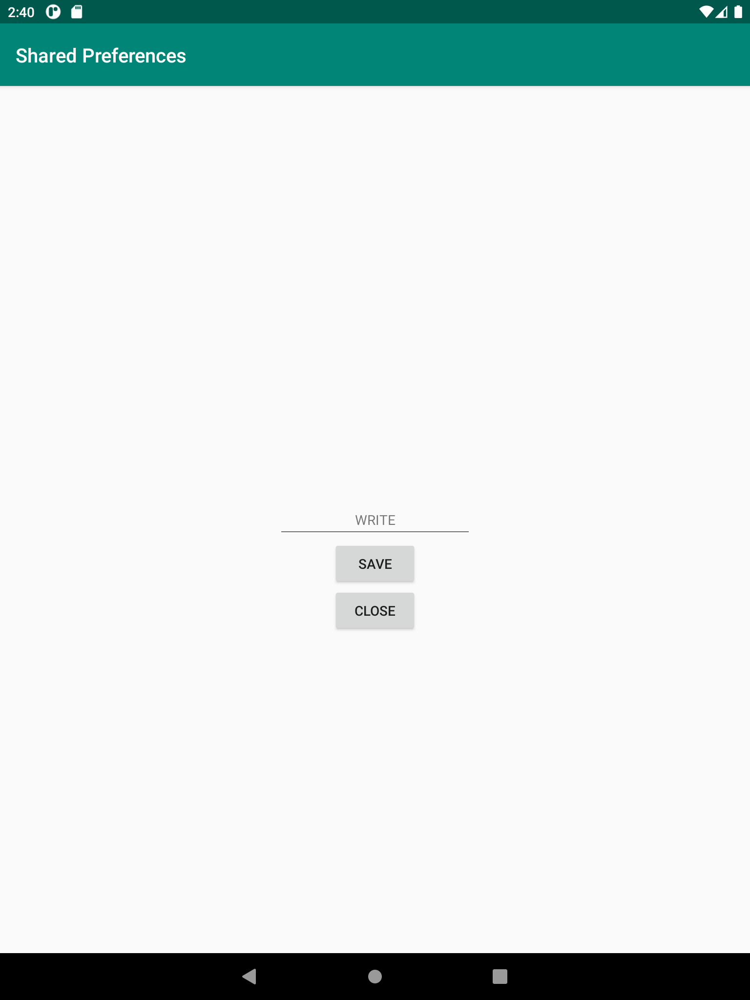
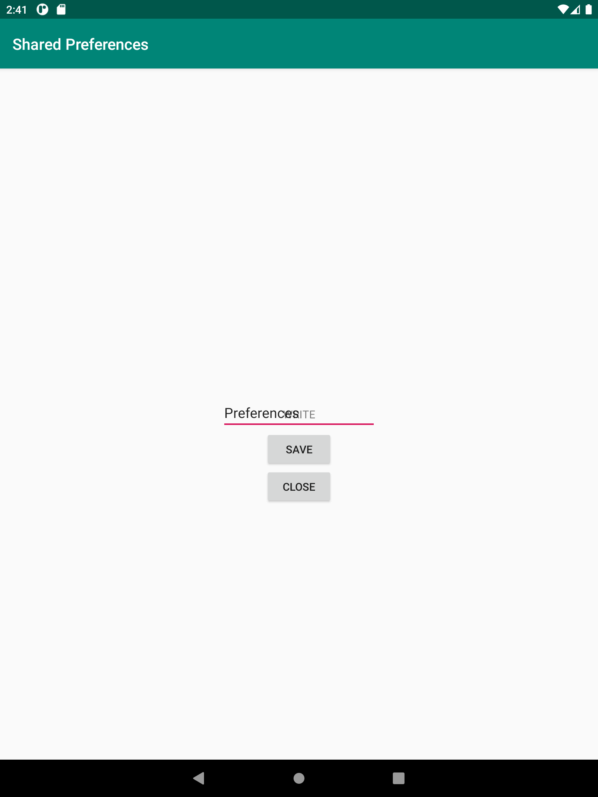
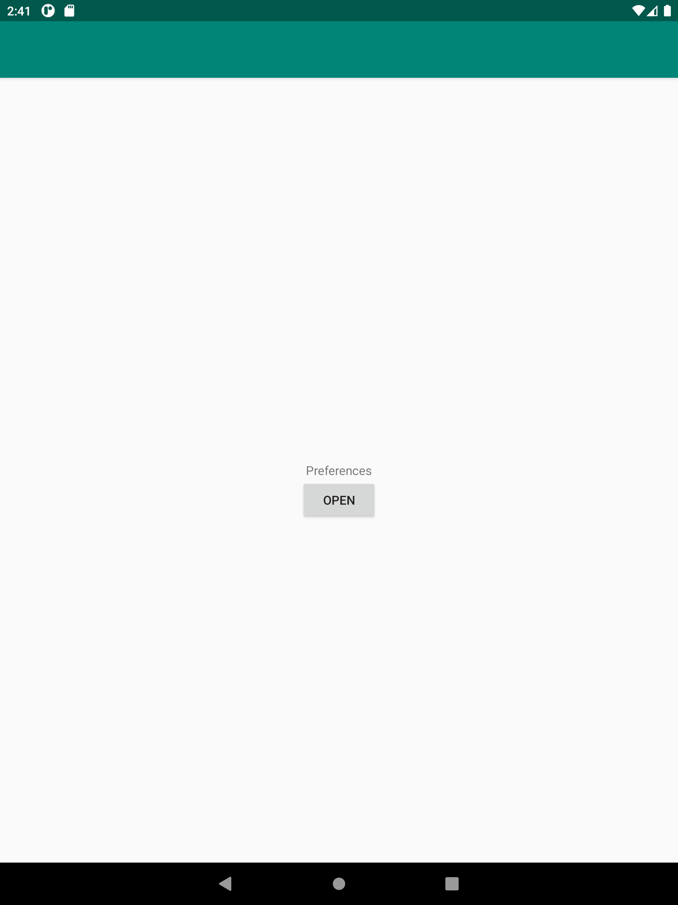

# Rapport

**Skriv din rapport här!**

Det första som skall göras är att skapa ett sätt för att läsa data genom Shared Preferences samt 
skapa en ytterligare Activity. Min andra activity heter WriteActivity.java. 

Här skapar jag en medlems variabel för Shared Preferences
///
SharedPreferences preferences;
///
Här så skapar jag möjligheten för att medlems variabeln ska kunna spara ned datan som skrivs i 
write filen. 
///
preferences = getSharedPreferences("preferences", MODE_PRIVATE);

save.setOnClickListener(new View.OnClickListener() {
@Override
public void onClick(View view) {
String input = text.getText().toString();

                SharedPreferences.Editor editor = preferences.edit();
                editor.putString("name",input);
                editor.apply();
            }
        });
///

Här hämtar vi strängen som sparades ned från Write filen till Read filen via preferences.getstring.
samt on.resume(); som gör det möjligt att presentera strängen efter att write filen har stängts. 
///
@Override
protected void onResume() {
super.onResume();

String name = preferences.getString("name","inget namn hittades");
textviewname.setText(name);
///

Kod som gör det möjligt via en button att stänga ned write filen, "finish();" är det kommandot
som gör det möjligt att stänga ned filen. 
///
Button close;

close.setOnClickListener(new View.OnClickListener() {
@Override
public void onClick(View view) {
finish();
}
});
///

